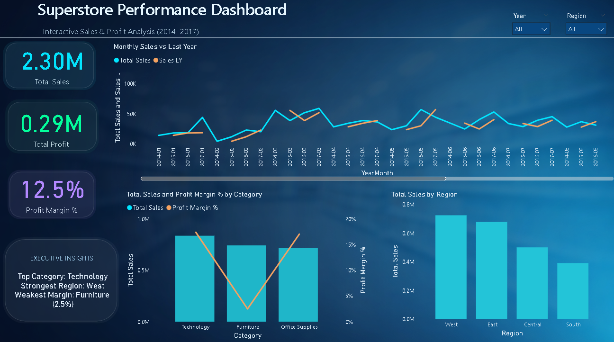
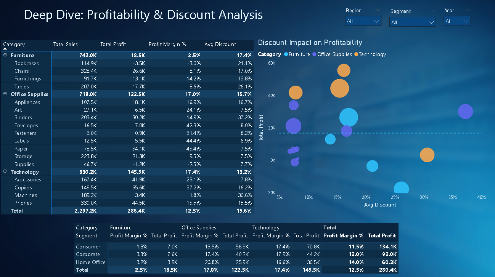

# Superstore Performance Dashboard

## 📊 Project Overview
This Power BI dashboard analyzes sales, profit, and customer performance using the Superstore dataset.

The goal was to identify revenue trends, region-wise performance, and product profitability to support business decision-making.

---

## 🛠 Tools & Technologies
- Power BI
- Power Query
- DAX
- Data Modeling

---

## 📈 Key KPIs Created
- Total Sales
- Total Profit
- Profit Margin %
- Year-to-Date (YTD) Sales
- Top Customers
- Region-wise Performance

---

## 🧠 Business Insights
- West region generated the highest revenue.
- Technology category showed the highest profitability.
- Some sub-categories had high sales but low profit margin.

---

## 📷 Dashboard Preview

### Overview Page

### Deep Dive Analysis Page

---

## 📌 What I Learned
- Created a Date Table for time intelligence.
- Built DAX measures for KPIs.
- Applied slicers for dynamic filtering.
- Designed interactive visuals for business storytelling.
